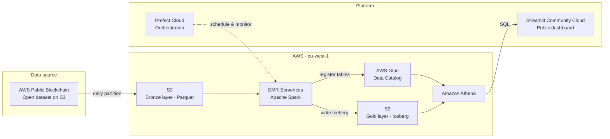
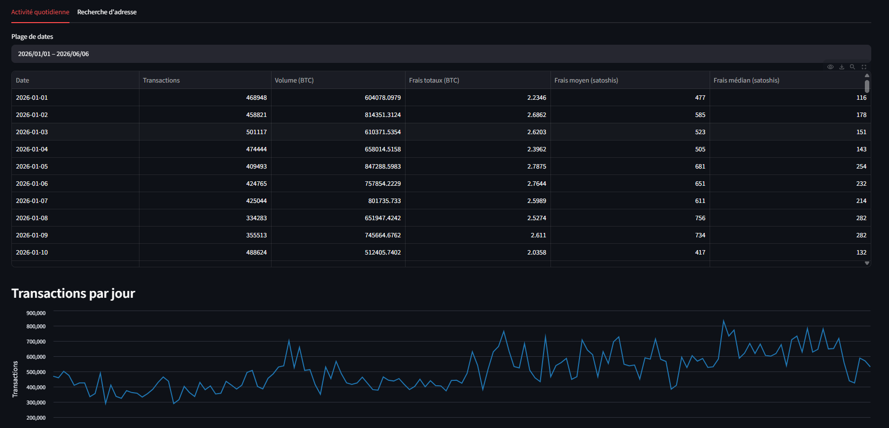
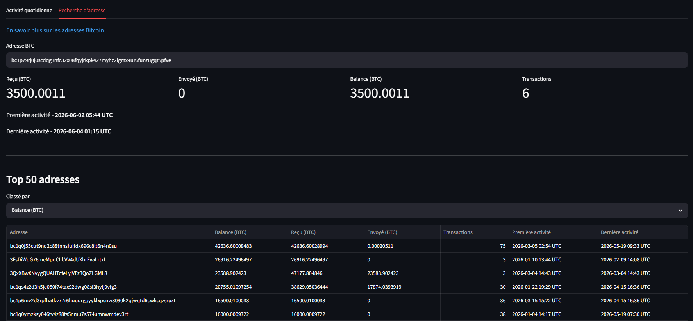

# btc-lakehouse

End-to-end Bitcoin on-chain analytics pipeline — from raw blockchain data to a live public dashboard.

**[→ Live dashboard: btc-lakehouse.streamlit.app](https://btc-lakehouse.streamlit.app/)**

---

## Architecture



The pipeline runs daily:
1. **Ingest** — copies a daily Parquet partition from the AWS Public Blockchain dataset to S3 (bronze layer)
2. **Transform** — Spark jobs on EMR Serverless compute two gold tables:
   - `daily_metrics` — aggregated transactions, volume, and fees per day
   - `address_stats` — per-address balance, received, sent, and tx count (partitioned with `bucket(address, 256)`)
3. **Query** — Athena reads the Iceberg gold tables via the Glue catalog
4. **Dashboard** — Streamlit fetches data from Athena and renders charts and tables

Infrastructure is fully managed with Terraform. Flows are orchestrated by Prefect Cloud and deployed automatically via GitHub Actions on push to `main`.

---

## Dashboard

The dashboard exposes two tabs:

### Métriques journalières

Daily network activity with a date range filter:
- Transactions, volume (BTC), and average fees per day as line charts
- Correlation matrix between key metrics



### Recherche d'adresse

- Look up any Bitcoin address by its full address: balance, received, sent, tx count, first and last activity
- Top 50 addresses ranked by balance, received, sent, or transaction count



---

## Tech stack

| Layer | Technology |
|---|---|
| Data source | [AWS Public Blockchain](https://registry.opendata.aws/aws-public-blockchain/) |
| Storage | Amazon S3 + Apache Iceberg |
| Processing | EMR Serverless (Apache Spark) |
| Catalog | AWS Glue Data Catalog |
| Query | Amazon Athena |
| Orchestration | Prefect Cloud |
| Dashboard | Streamlit Community Cloud |
| IaC | Terraform |
| CI/CD | GitHub Actions |
| Language | Python 3.13 · uv |

---

## Installation

**Requirements:** Python 3.13 and [uv](https://docs.astral.sh/uv/getting-started/installation/)

```bash
git clone https://github.com/jburnich/btc-lakehouse.git
cd btc-lakehouse
uv sync
cp .env.example .env
```

---

## Usage

```bash
# Ingest a daily BTC partition to S3
uv run ingest 2026-01-01

# Compute gold metrics (daily_metrics + address_stats)
uv run transform 2026-01-01

# Run a specific job only
uv run transform 2026-01-01 --job daily_metrics
uv run transform 2026-01-01 --job address_stats
```

After provisioning, synchronize the Iceberg tables with the Glue catalog (idempotent — re-run after any schema change):

```bash
uv run sync-tables
```

### Run the dashboard locally

```bash
streamlit run streamlit/app.py
```

Requires the following environment variables (see `.env.example`):

```
AWS_ACCESS_KEY_ID
AWS_SECRET_ACCESS_KEY
AWS_REGION
ATHENA_WORKGROUP
```

---

## Infrastructure

Managed with [Terraform](https://developer.hashicorp.com/terraform) >= 1.14. Provisions:
- S3 bucket (bronze + gold layers)
- EMR Serverless application
- Glue catalog database
- Athena workgroup
- IAM roles (EMR execution, Streamlit read-only)

The Terraform state is stored in a private S3 backend. Set `TF_BACKEND_BUCKET` in your `.env` before initializing.

```bash
source .env
cd terraform
terraform init -backend-config="bucket=$TF_BACKEND_BUCKET"
terraform apply
```

After applying, add the outputs to your `.env`:

```bash
terraform output emr_application_id
terraform output emr_execution_role_arn
```

---

## Orchestration

Flows are orchestrated with [Prefect Cloud](https://app.prefect.cloud) (free tier).

### Setup

1. Create a **Managed** work pool named `managed-execution`
2. Add the following variables in **Settings → Variables**:
   - `aws-bucket-name`, `aws-region`, `emr-application-id`, `emr-execution-role-arn`
3. Add the following secrets in **Settings → Blocks → Secret**:
   - `aws-access-key-id`, `aws-secret-access-key`

### CI/CD

Flows are automatically deployed to Prefect Cloud on every push to `main` when `prefect.yaml` or `src/flows.py` changes.

Add the following secrets to your GitHub repository (**Settings → Secrets → Actions**):
- `PREFECT_API_KEY`
- `PREFECT_API_URL`

---

## Tests

```bash
uv run pytest
```

Three test suites cover the core pipeline logic:

- **`tests/test_ingest.py`** — S3 copy logic: partition upload, missing date, missing env vars
- **`tests/test_transform.py`** — Spark transformations using in-memory DataFrames (no AWS required):
  - `daily_metrics`: coinbase exclusion, aggregation by date, BTC→satoshi fee conversion
  - `address_stats`: balance calculation, tx count, first/last seen timestamps, null address filtering

Tests run automatically on every pull request targeting `main` via GitHub Actions. Merging is blocked if any test fails.
